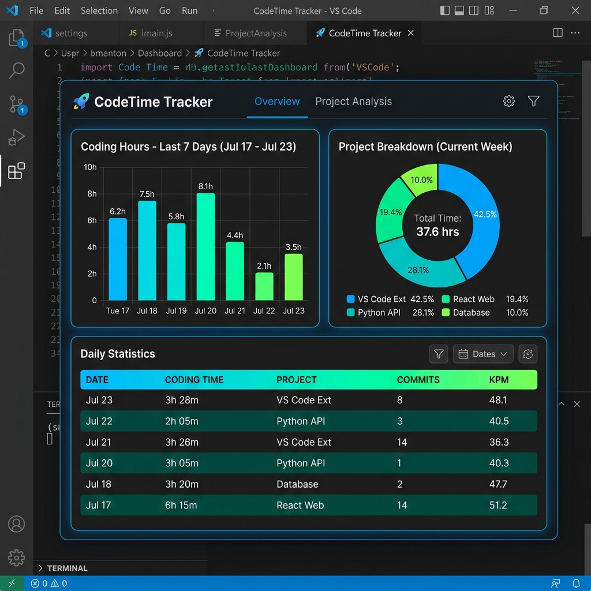

# Code Time Tracker

A powerful, local-first VS Code extension to track your coding time and visualize your productivity.

## Features

- ⏱️ **Active Time Tracking**: Automatically distinguishes between active coding and idle time using heartbeats.
- 📂 **Project breakdown**: View how much time you spend on different projects.
- 📊 **Interactive Dashboard**: Beautiful charts showing your weekly and daily performance.
- 📅 **Date Filtering**: Filter your stats by last 7, 30, or 90 days, or choose a custom range.
- 🔒 **Privacy First**: All data is stored locally on your machine. No external tracking or cloud syncing required.
- 🕒 **Status Bar Integration**: See your total coding time for the day directly in the status bar.

## Installation

You can download the latest `.vsix` file from the [Releases](https://github.com/Almadih/code-time-tracker/releases) page and install it in VS Code via:
`Extensions` -> `...` -> `Install from VSIX...`

## Usage

1. **Track**: Just start coding! The extension automatically tracks your activity.
2. **View Stats**: Click on the timer in the status bar (bottom right) or run the command `Code Time: Open Dashboard` from the Command Palette (`Ctrl+Shift+P`).
3. **Configure**: Adjust the inactivity timeout in VS Code Settings (`codeTimeTracker.inactivityTimeout`).

## Local Data Storage

Your data is stored in a JSON file at:
`~/.config/Code/User/globalStorage/almadih.code-time-tracker/data.json`

## License

MIT
